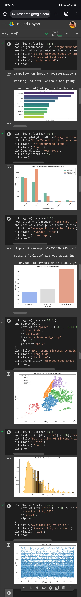

# Airbnb Booking Analysis 🏠📊

This project analyzes Airbnb listings in New York City to uncover patterns in pricing, availability, and distribution across neighborhoods.

---

## 📁 Dataset

**Name**: `AB_NYC_2019.csv`  
**Source**: [Inside Airbnb](http://insideairbnb.com/get-the-data.html)

---

## 📌 Objectives

- Explore the geographic distribution of listings
- Analyze average prices per neighborhood
- Study availability and room types
- Visualize trends in pricing and availability

---

## 🔍 Key Insights

- **Manhattan** has the highest number of listings and the highest average price.
- **Private rooms** are the most common, but **entire homes/apartments** generate the highest revenue.
- Listings in **Brooklyn** also show high availability, catering to long-term stays.
- Neighborhoods like **Harlem and Williamsburg** are growing popular among budget travelers.

---

## 📊 Visuals

### 🗺️ Listings Distribution Map

> A scatter map showing the geographic distribution of Airbnb listings across New York City.

---

## 🔧 Tools Used

- Python (Pandas, NumPy)
- Data Visualization: Matplotlib, Seaborn
- Jupyter Notebook / Google Colab

---

## ✍️ Section made by Pranjal Dubey

This project is part of a data analytics portfolio focused on practical, real-world datasets.  
More projects coming soon!

---
